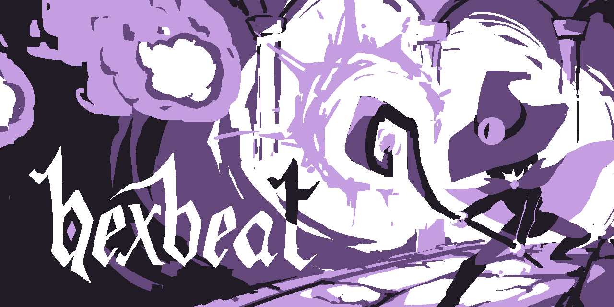

---

***HEXBEAT*** is a short rhythm game made for the original Nintendo Game Boy. Defend yourself against an onslaught of spells by timing your shields to the music, and survive until the end!

# Table of Contents
1. [How to Play](#how-to-play)
2. [How to Build](#how-to-build)
3. [Credits](#credits)

---

# How to Play:
***HEXBEAT*** uses 2 buttons for gameplay, and 2 buttons for handling:
* **[A]** - press **A** to attack the high line
* **[B]** - press **B** to attack the low line
* **[START]** - when prompted, press **START** to begin the game
* **[SELECT]** - when prompted, press **SELECT** to restart the game

Use A and B as appropriate when a matching spell crosses its respective "target zone" in front of the player character. Pressing too early or too late will damage the player--you need to time it just right!

<p align="center">
  
&nbsp; &nbsp; &nbsp; &nbsp; &nbsp; &nbsp; &nbsp; &nbsp;
  
</p>

Survive 3 waves of increasing difficulty in order to win!


# How to Build:
```
# Open a terminal (Command Prompt or PowerShell for Windows, Terminal for macOS or Linux)

# Ensure Git is installed
# Visit https://git-scm.com to download and install console Git if not already installed

# Clone the repository
git clone git@github.com:cs240-spring2025/game-sydney-alfonso.git

# Navigate to the project directory
cd game-sydney-alfonso

# Compile the project
make
```
---
# CREDITS:
**Game Design:** Sydney Chen, Alfonso Rada <br>
**Art & Music:** Sydney Chen

Special thanks to Darren Strash and Maximilien Dagois!

*This game's code is licensed under the GNU GPL*<br>
*Visual assets are licensed under CC NC*<br>
*More information can be found in [LICENSE.md](assets/LICENSE.md)*

